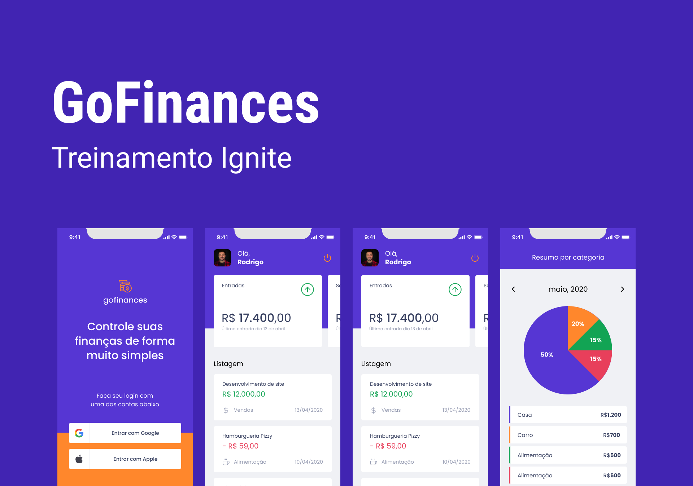

<h1 align="center">
  
   
   
</h1>

 

  

 

<h2>GoFinances</h2>

 

Aplicativo que ajuda a gerenciar suas finanças pessoais.

 

 
 Acesse uma demonstração do aplicativo:
  
  
 <a href="https://expo.io/@kilsonrs/gofinances-app" target="_blank" rel="noopener noreferrer">https://expo.io/@kilsonrs/gofinances-app</a>
 

 
 
 

---

Kilson 👋 &nbsp;[See my linkedin](https://www.linkedin.com/in/kilsonrs/)

